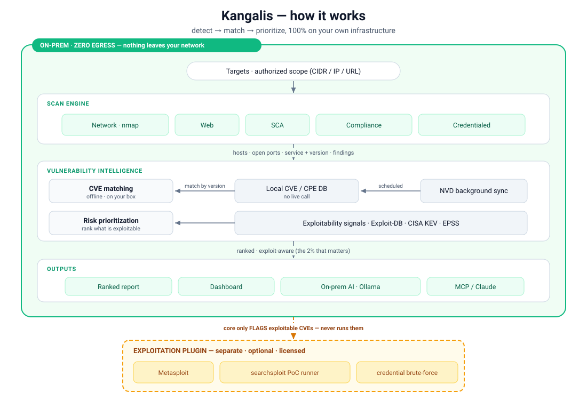

<p align="center">
  <a href="README.md"></a>
  &nbsp;
  <a href="README.tr.md"></a>
</p>

# Kangalis

> **İç ağınızın bekçisi** — birincil odağı **iç ağ/sistem taraması** olan, web panelli, Python tabanlı bir zafiyet yönetim platformu.

[](https://github.com/Lineup-NOAH/kangalis-core/actions/workflows/ci.yml)
[]()
[]()
[]()

Hafif, tamamen kendi sunucunuzda çalışan bir iç-ağ zafiyet tarayıcısı: iç ağınızdaki host'ları ve
servisleri keşfeder, bunları bilinen zafiyetlerle (CVE) eşleştirir ve
**sömürülebilirlik sinyalleriyle** (Exploit-DB, CISA KEV, EPSS) zenginleştirerek **risk
önceliklendirmesi** sunar. Ayrıca **MCP** üzerinden Claude ile konuşabilir.

<p align="center">
  
</p>

> ⚠️ **Yasal uyarı:** Bu araç yalnızca **yetkili kapsam** içinde (sahibi olduğunuz ya da test etmeye
> izinli olduğunuz ağlar) kullanılmalıdır. Yetkisiz tarama yasa dışıdır. Yazılım **"olduğu gibi",
> garanti olmaksızın** sağlanır; kullanmak [Sorumluluk Reddi'ni](DISCLAIMER.md) kabul ettiğiniz
> anlamına gelir.

## 📦 Açık-kaynak çekirdek

Bu depo, **açık-kaynak çekirdektir** (MIT): ağ/host keşfi, port ve servis/sürüm tespiti, CVE
eşleştirme, sömürülebilirlik **sinyalleri** (Exploit-DB/CISA KEV/EPSS — *yalnız bilgilendirme*),
uyumluluk denetimleri (CIS/KVKK/ISO/PCI), raporlama ve yerel (yerinde) savunmacı AI. Bu çekirdek
exploit **ÇALIŞTIRMAZ.** Gerçek sömürü/sızma (Metasploit orkestrasyonu, sandbox'lı PoC çalıştırma,
kimlik brute-force) ayrı, opsiyonel bir **sömürü (exploitation) eklentisinde** tutulur ve bu deponun
**parçası değildir**. Çekirdek, eklenti olmadan tam işlevseldir.

> **nmap gerekir:** Tarama motoru `nmap` ikilisini çağırır; o olmadan tarama **çalışmaz.** Elle
> kurmanıza gerek yok — `docker compose up --build` sırasında imaja **otomatik** eklenir
> (`ARG INSTALL_NMAP=true`, varsayılan açık). nmap, **NPSL** (Nmap Public Source License) ile
> dağıtılır; Kangalis ikiliyi yeniden dağıtmaz — derlemeniz onu Debian deposundan çeker.
> Ayrıntı: [`docs/INSTALL.md`](docs/INSTALL.md) ve [`THIRD-PARTY-NOTICES.md`](THIRD-PARTY-NOTICES.md).

## Özellikler

- 🔍 **Ağ & host taraması** — host keşfi, port taraması, servis/sürüm tespiti (nmap)
- 🛡️ **CVE eşleştirme + risk skoru** — NVD/OSV + Exploit-DB + CISA KEV + EPSS
- 🌐 **Web taraması** — güvenlik başlıkları, TLS/SSL denetimleri, dizin keşfi
- 📦 **SCA** — bağımlılık (requirements.txt, package.json) zafiyet taraması
- ✅ **Uyumluluk denetimleri** — CIS/KVKK/ISO/PCI kontrolleri ve raporlama
- 🤖 **MCP sunucusu** — Claude tarama başlatır ve sonuçları sorgular
- 🧠 **Yerel (yerinde) savunmacı AI** — bulgu özetleri ve uyumluluk anlatıları
- 📊 **Web paneli** — HTMX + Tailwind

Mimari/tasarım: [`docs/PROJECT_PLAN.md`](docs/PROJECT_PLAN.md)

## Nasıl çalışır

Çoğu tarayıcı önünüze on binlerce CVE'lik bir duvar yığar ve çekip gider. Kangalis tek bir soru
etrafında kurulmuştur: **burada beni gerçekten ne vurabilir — ve önce neyi düzeltmeliyim?** Uçtan
uca, **kendi altyapınızda** çalışan sıkı bir **tespit → eşleştir → önceliklendir** hattı yürütür
(yukarıdaki şemaya bakın).

**Her adım neden önemli**

- **1 · Keşif (nmap).** Savaşta sınanmış parmak-izi çıkarımı, iç ağınızdaki her canlı host'u, açık
  portu ve servis sürümünü haritalar — geri kalan her şeyin üzerine kurulduğu temel gerçek budur.
- **2 · CVE eşleştirme — çevrimdışı, kendi makinenizde.** nmap *neyin çalıştığını* söyler; Kangalis o
  sürümü **kendi yerel CVE/CPE veritabanıyla** eşleştirir (arka plan senkronu NVD'den aynalar).
  **Tarama başına internet çağrısı yok — ağınıza dair hiçbir şey makinenizden çıkmaz.** Tamamen
  **air-gap (hava-boşluklu)** çalışır; bu, bankalar, OT/ICS ve bulut tarayıcıların yapısal olarak
  karşılayamadığı diğer regüle ortamlar için katı bir gerekliliktir.
- **3 · CVE dökümü değil, risk önceliklendirmesi.** Her eşleşme gerçek-dünya **sömürülebilirlik
  sinyalleriyle** zenginleştirilir — Exploit-DB (genel bir exploit var), **CISA KEV** (vahşi doğada
  aktif sömürülüyor) ve **EPSS** (istatistiksel sömürü olasılığı). Saldırganların gerçekten kullandığı
  ~%2 yukarı çıkar; teorik gürültü dibe iner.

**Kangalis'i farklı kılan**

- 🔒 **%100 yerinde · sıfır dışa-veri.** Tarama, veri, zafiyet veritabanı ve AI'nın hepsi kendi
  donanımınızda kalır. Tasarımı gereği air-gap'e hazır.
- 🎯 **Exploit-farkında önceliklendirme.** KEV + EPSS + Exploit-DB *"10.000 CVE"*yi *"bugün şu 12
  tanesi"*ne çevirir.
- ✅ **Dürüst güven.** Bulgular **NSE-doğrulandı** (aktif doğrulanmış) ile **sürümden-çıkarıldı**
  (olası) olarak etiketlenir — yanlış-pozitif tiyatrosu yok.
- 🛡️ **Varsayılan güvenli.** Varsayılan mod müdahaleci değildir; agresif sondaj **isteğe bağlı ve
  kapılıdır**, böylece bir tarama üretimi devirmez.
- 🧠 **Yerinde savunmacı AI.** Yerel bir model (Ollama) bulguları açıklar ve çözüm taslağı yazar —
  tetiği her zaman bir insan çeker ve hiçbir veri makineden çıkmaz.
- 🤖 **Claude-yerel (MCP).** Taramaları doğrudan Claude'dan başlatın ve sonuçları sorgulayın.
- 📋 **Uyumluluk yerleşik.** CIS · KVKK · ISO 27001 · PCI-DSS kontrolleri ve denetime-hazır raporlar.

**Tarama modları**

| Mod | Ne yapar |
|---|---|
| **Ping** | hızlı host keşfi |
| **Ağ** | portlar · servisler · sürümler (+ sürümden-çıkarılan CVE'ler) |
| **Güvenli CVE** | yerel CVE-DB eşleştirmesi, müdahaleci değil — **varsayılan** |
| **Agresif CVE** | + canlı NVD + aktif NSE doğrulaması — *yine de asla sömürmez*; isteğe bağlı / kapılı |
| **Web CVE** | web-yığını CVE'leri (güvenlik başlıkları · TLS · uygulama) |
| **Kimlikli** | kimlik doğrulamalı denetimler (SSH/Windows/DB/SNMP/SMB/LDAP) + uyumluluk |

(ayrıca bağımlılık manifestoları için **SCA**)

### 🧩 Sömürü — ayrı, premium bir eklenti (bu depoda değil)

Açık-kaynak çekirdek sömürülebilir CVE'leri **bulur ve işaretler** ama **asla bir exploit
çalıştırmaz** — her yere sıfır yükümlülükle kurabileceğiniz temiz, savunmacı bir araç. *"muhtemelen
sömürülebilir"*den *kanıt*a geçmek için opsiyonel, lisans-kapılı **sömürü eklentisi** devreye girer
(Metasploit orkestrasyonu, sandbox'lı Exploit-DB/searchsploit PoC çalıştırıcısı, kimlik
brute-force). Çekirdek yalnızca Exploit-DB **meta-veri sinyalini** taşır (*bir exploit var* — id ↔
CVE ↔ URL, bilgilendirme amaçlı); PoC'leri çekmek ve **çalıştırmak** eklentinin işidir.

## Sistem gereksinimleri

Her şey Docker konteynerlerinde çalışır; bu yüzden host'un **tek** katı önkoşulu **Docker + Docker
Compose**'tur — `nmap`, Python, PostgreSQL, Redis ve (opsiyonel) yerel AI modeli hepsi imajların
içinde sağlanır. Elle kurulacak bir şey yok.

| Kaynak | Çekirdek (tarama + panel) | + Yerel AI (opsiyonel) |
|---|---|---|
| **CPU** | 2 çekirdek (4 önerilir) | 4 çekirdek (8+ önerilir — CPU çıkarımı) |
| **RAM** | en az 4 GB · **8 GB önerilir** | **+8 GB** → toplam **16 GB** önerilir |
| **Disk** | ~5 GB (10 GB önerilir) | **+6 GB** → ~15–20 GB |
| **GPU** | — | gerekmez (yalnız-CPU); GPU yalnızca AI'yı hızlandırır |

**İşletim sistemi** — Docker çalıştıran her şey:
- **Linux** — yerel Docker Engine (üretim / air-gap siteler için önerilir).
- **Windows 10/11** — Docker Desktop (WSL2 arka ucu).
- **macOS 12+** — Docker Desktop (Apple Silicon ya da Intel).

**Yazılım & bağlantı**
- **Docker Engine 24+** ve **Docker Compose v2** — tek katı gereksinim.
- İnternet yalnızca **ilk** derleme/çekme ve CVE-veritabanı tohumu (~42 MB) için gerekir. Sonrasında
  tarayıcı — ve yerel AI — **tamamen çevrimdışı / air-gap** çalışır.
- Opsiyonel: daha hızlı zafiyet-veritabanı senkronu için ücretsiz bir **NVD API anahtarı**.

**Ayak izi nereye gidiyor** (canlı bir kurulumda ölçüldü)
- İmajlar: çekirdek ~0,9 GB · PostgreSQL ~0,6 GB · Redis ~0,15 GB.
- Zafiyet veritabanı: **~0,5 GB**, kurulumda ≈220 bin CVE + 1,3 milyon CPE kuralıyla önceden
  tohumlanmış.
- Yerel AI modeli `qwen3:8b`: **~5 GB** (tek seferlik, bir Docker volume'ünde saklanır).

> **🧠 Yerel-AI belleği (Windows/macOS'ta Docker Desktop).** AI konteyneri modeli tutmak için ~8 GB
> ister (`mem_limit`, env `AI_MEM_LIMIT`, varsayılan `8g`). Docker Desktop fiziksel RAM'in yalnızca
> bir *dilimini* ayırır (varsayılan ≈yarısı); bu yüzden **16 GB**'lık bir dizüstünde AI sığmayabilir.
> Docker'a ≥12 GB verin (Windows: `%UserProfile%\.wslconfig` → `memory=…`; ya da Docker Desktop →
> Settings → Resources) ya da `AI_MEM_LIMIT`'i düşürün. **Tarama çekirdeği 4–8 GB'da rahat çalışır —
> AI tamamen opsiyoneldir.**

> **⚙️ Yerel-AI CPU kullanımı.** Model CPU'da koşar ve çekirdekleri **yalnızca bir yanıt üretirken**
> kullanır (özet başına birkaç saniye) — geri kalan zamanda ~%0'da boşta durur. Çekirdekle
> ölçeklenir: **4 çekirdek yeterlidir** (yanıtlar daha yavaş), 8+ yalnızca daha hızlı yanıt verir.
> Tarama çekirdeğinin kendisine ~2 yeter. Az-çekirdekli bir host'ta `OLLAMA_NUM_THREAD=N` (ya da bir
> Compose `cpus:` limiti) ile sınırlayabilirsiniz; böylece bir AI yanıtı tüm makineyi kısa süreliğine
> kaplamaz.

> **🌐 Ağ erişilebilirliği.** Taramalar worker konteynerinden koşar; bu yüzden host'un taradığınız
> ağlara katman-3 bağlantısı olmalıdır (aynı alt-ağ/VLAN ya da onlara bir rota).

## Kurulum (hızlı başlangıç)

**Tek önkoşul: Docker + Docker Compose.** Tamamen **yerinde** çalışır: tarama, veri ve AI'nın hepsi
kendi makinenizde kalır — hiçbir veri dışarı çıkmaz.

### Seçenek 1 — Kurulum sihirbazı (en kolayı; kaynaktan derler)

Tek komut: derle + başlat → migrasyon **otomatik** koşar → bir admin kullanıcı sorar → yetkili tarama
kapsamını/CIDR'ını sorar. `nmap` dahil her şey imaja otomatik iner (elle kurulum yok).

```bash
# Linux / macOS
bash setup.sh          # ya da:  make setup

# Windows (PowerShell)
powershell -ExecutionPolicy Bypass -File setup.ps1
```

### Seçenek 2 — Yayınlanan imajla (derleme yok; daha hızlı)

Önceden derlenmiş imajları doğrudan kayıt defterinden (ghcr.io) çekip çalıştırın — yerel derleme
gerekmez:

> **Not:** bunun çalışması için önceden-derlenmiş imajın yayınlanmış ve public olması gerekir.
> `docker compose pull` `unauthorized` ya da `not found` derse imaj henüz yok demektir — her zaman
> çalışan **Seçenek 1**'i (kaynaktan derleme) kullanın.

```bash
git clone https://github.com/Lineup-NOAH/kangalis-core.git && cd kangalis-core
cp .env.example .env              # gizli anahtarları doldurun (ya da Seçenek 1 sihirbazını çalıştırın)

docker compose pull              # yayınlanan çekirdek imajı çeker (derleme YOK)
docker compose up -d             # başlatır; migrate şemayı otomatik kurar

# Admin kullanıcı + yetkili tarama kapsamı (ZORUNLU):
docker compose exec app python -m cybersectool.scripts.create_user \
    --username <ad> --password <parola> --role admin
# Kapsamı panelden (Ayarlar → Yetkili Kapsam) ya da docs/INSTALL.md §3.3 ile tanımlayın.
```

> Bir sürüme sabitlemek için `.env`'de `KANGALIS_IMAGE=ghcr.io/lineup-noah/kangalis-core:vX.Y.Z`
> ayarlayın.

Sonra paneli açın: **http://localhost:8000/login**

> ⚠️ Yetkili bir **kapsam** (CIDR) tanımlanana kadar tarama çalışmaz. Yalnızca taramaya **yetkili**
> olduğunuz ağları girin.

### Sıfırlama / temiz yeniden kurulum

Kurulum bozulursa ya da DB kullanıcı/parolasını değiştirmek isterseniz, **eski veritabanı volume'ü
yeni `.env` ile çakışır** (`migrate` → `password authentication failed for user ...`). PostgreSQL
kullanıcı/parolayı yalnızca ilk açılışta gömer; klasörü/Docker'ı silmek volume'ü **kaldırmaz.** Temiz
bir sıfırlama için tek komut:

```bash
# Windows
powershell -ExecutionPolicy Bypass -File reset.ps1

# Linux / macOS
bash reset.sh
```

> ⚠️ Bu, tüm tarama verisini **siler** (`docker compose down -v` + her `kangalis*` volume'ü). Sonra
> `setup.ps1`/`setup.sh` ya da `docker compose up -d --build` ile yeniden kurun. `.env`'inizi (gizli
> anahtarlar) korur; sıfırdan silmek için `-IncludeEnv` / `--include-env` ekleyin. Elle:
> `docker compose down -v` → `docker volume ls | grep kangalis` boşalana kadar
> `docker volume rm <ad>` çalıştırın.

### Yerel AI (opsiyonel, yerinde, sıfır dışa-veri)

AI tamamen yereldir (CPU'da koşar); yalnızca öneri/taslak üretir ve eylemi her zaman bir insan
tetikler. **Önerilen yol — Ollama** (resmî `ollama/ollama` imajı; model çalışma zamanında çekilir):

```bash
docker compose --profile ai up -d ollama          # Ollama motoru (Docker Hub, public)
docker compose exec ollama ollama pull qwen3:8b   # modeli indir (~5 GB, tek seferlik)
```

Sonra panelde **Eklentiler → AI** altında: endpoint `http://ollama:11434/v1`, model `qwen3:8b`,
"Bağlantıyı test et" → yeşil.

> **Air-gap / sıfır çalışma-zamanı indirme (opsiyonel):** modeli **gömülü** taşıyan `kangalis-ai`
> imajını kullanabilirsiniz (`-f docker-compose.ai-baked.yml`). Yayınlanan imajı çekmek için ghcr
> paketinin **public** olması gerekir — yoksa `unauthorized` alırsınız. Alternatif: internetli bir
> makinede yerel olarak derleyin (`bash build-ai-image.sh` / `powershell -File build-ai-image.ps1`).
> Ayrıntı: [`docs/PLUGINS.md`](docs/PLUGINS.md).

- 📘 Ayrıntılı kurulum / elle adımlar / üretim dağıtımı: [`docs/INSTALL.md`](docs/INSTALL.md)
- 🧩 Opsiyonel özellikler (yerel AI, MCP, eklentiler): [`docs/PLUGINS.md`](docs/PLUGINS.md)

## Teknoloji yığını

| Katman | Seçim |
|---|---|
| Dil / paketleme | Python 3.12+ · uv |
| Arka uç | FastAPI |
| Veritabanı | PostgreSQL + SQLAlchemy + Alembic |
| Görev kuyruğu | Celery + Redis |
| Ön yüz | Jinja2 + HTMX + Tailwind |
| Tarama | nmap, httpx |
| Dağıtım | Docker + docker-compose |

## Geliştirme ortamı

Gereksinim: [uv](https://docs.astral.sh/uv/) (uv, Python'u kendisi indirir).

```bash
# Bağımlılıkları kur (Python 3.12 dahil)
uv sync

# Testleri çalıştır
uv run pytest

# Lint & tip denetimleri
uv run ruff check .
uv run mypy

# (Opsiyonel) pre-commit kancalarını kur
uv run pre-commit install
```

## Proje yapısı

```
src/cybersectool/
├── core/        # ortak iş mantığı (servis katmanı) + kapsam koruması
├── scanners/    # tarama modülleri (network, web, sca, hardening)
├── intel/       # zafiyet/exploit veri kaynakları (NVD, OSV, EDB, KEV, EPSS)
├── api/         # FastAPI router'ları
├── web/         # panel (Jinja2 + HTMX)
├── tasks/       # Celery görevleri
└── mcp/         # MCP sunucusu
```

## Katkı / iş akışı

**main**'e fork + PR. Conventional Commits. Her PR `ruff` + `mypy` + `pytest`'ten geçmelidir.
Ayrıntı: [CONTRIBUTING.md](CONTRIBUTING.md)

## Lisans

[MIT](LICENSE) © 2026 Lineup-NOAH

- Üçüncü-parti bağımlılık lisansları: [THIRD-PARTY-NOTICES.md](THIRD-PARTY-NOTICES.md)
- Güvenlik & sorumlu/yetkili kullanım: [SECURITY.md](SECURITY.md)
- **Sorumluluk reddi & kullanım koşulları:** [DISCLAIMER.md](DISCLAIMER.md)
